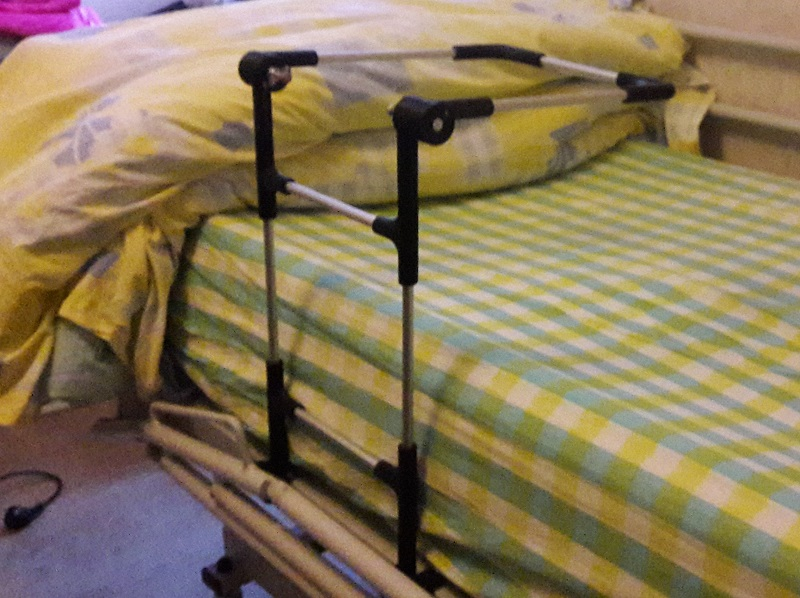

# Arceau de lit de voyage

[](https://docs.humanlab.me/myhumankit/arceau-de-lit-de-voyage)

Concevoir et réaliser un arceau de lit pour le voyage, dont la particularité est d'être facilement transportable et qui doit être pliable et/ou démontable.




## Liens
 * [documentation du projet](https://docs.humanlab.me/myhumankit/arceau-de-lit-de-voyage)
 * [page d'accueil du projet sur le GesLab](https://rennes.humanlab.me/projet/arceau-de-lit-de-voyage/)
 * [page wiki du projet sur le wiki du Humanlab](http://wikilab.myhumankit.org/index.php?title=Projets:Arceau_de_lit_de_voyage)


## Fonctionnalités
Ce dépôt GitHub est principalement utilisé pour stocker l'ensemble des informations (documents, modèles 3D, code, plans, etc.) nécessaires au projet _Arceay_.

Le fichier _project.json_ permet notamment de générer la documentation finale du projet à l'aide de l'outil [myworkshop](https://github.com/myhumankit/myworkshop).

## Installation
[Téléchargez ce dépôt](https://github.com/myhumankit/arceau-de-lit-de-voyage/archive/master.zip) et décompressez le dans le répertoire de votre choix. Renommez le dossier `arceau-de-lit-de-voyage-master` en `arceau-de-lit-de-voyage`.

Il est possible de cloner directement ce dépôt dans le répertoire de votre choix :

```
$ git clone git@github.com:myhumankit/arceau-de-lit-de-voyage.git
```

## Briques technologiques utilisées
 * [myworkshop](https://github.com/myhumankit/myworkshop).

## Gestion de version
La gestion de version repose sur le système [SemVer](http://semver.org/). Voir le fichier [CHANGELOG.md](CHANGELOG.md) pour plus de détails.

## Contribuer
Si vous souhaitez contribuer au projet, merci de créer une _issue_ ou de _forker_ ce projet et de créer une nouvelle branche. Toutes les _pull requests_ sont les bienvenues !

## Licence
Ce projet est diffusé sous la licence MIT. Voir le fichier [LICENSE](LICENSE) pour plus de details.

## Contributeurs
 * **sebastien Duchossoy** 

---

# Travel bed arch

## Links
 * [Documentation page of the project](# Arceau de lit de voyage

[](https://docs.humanlab.me/myhumankit/arceau-de-lit-de-voyage)

Create a travel bed arch , whose particularity is to be easily transportable and foldable and / or removable.Make a travel bed arch easily transportable Concevoir et réaliser un arceau de lit pour le voyage, dont la particularité est d'être facilement transportable et qui doit être pliable et/ou démontable.


## Features
This very GitHub repository is used to collect all available information (documents, 3D models, code, blueprints, etc.) regarding the project _Station de documentation_.

The _project.json_ file allows the final documentation generation using the tool [myworkshop](https://github.com/myhumankit/myworkshop).

## Installation
[Download this repository](https://github.com/myhumankit/arceau-de-lit-de-voyage/archive/master.zip) and unzip it into the Arduino libraries folder on your computer. You should rename the folder arceau-de-lit-de-voyage-master` in `arceau-de-lit-de-voyage`.

Or clone the repository directly in the Arduino libraries folder:

```
git clone git@github.com:myhumankit/arceau-de-lit-de-voyage.git
```

## Technologie used
 * [myworkshop](https://github.com/myhumankit/myworkshop).

## Versioning
We use [SemVer](http://semver.org/) for versioning. See the [CHANGELOG.md](CHANGELOG.md) file for details.

## Contributing
If you'd like to contribute, please raise an issue or fork the repository and use a feature branch. Pull requests are warmly welcome.

## Licensing
The code in this project is licensed under MIT license. See the [LICENSE](LICENSE) file for details.

## Contributors
 * **Sebastien Duchossoy** - 

